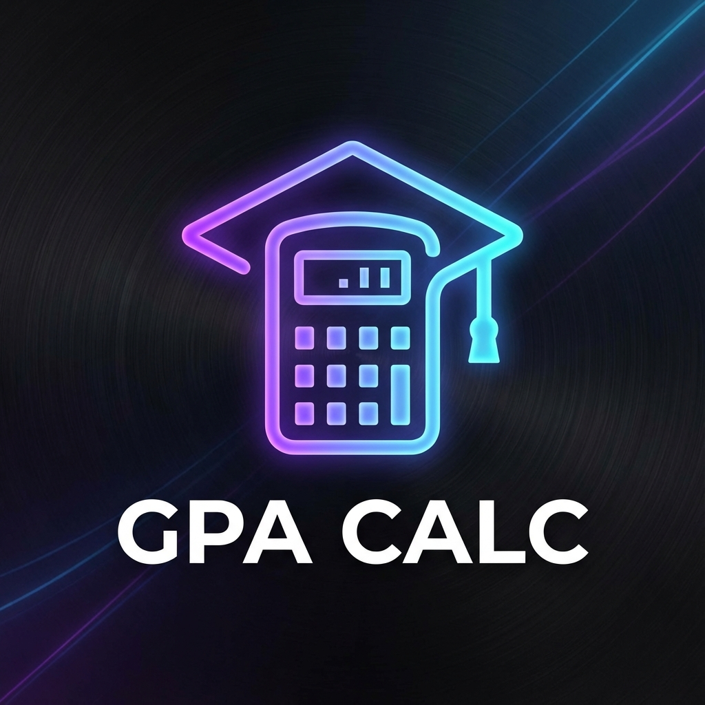

# GPA PRO - Academic Excellence Manager



**GPA PRO** is a modern, premium GPA calculator application designed to help students track their academic progress with precision and style. Built with React, Vite, and Framer Motion, it features a stunning dark-mode interface, advanced animations, and full bilingual support (English/Arabic).

## 🚀 Key Features

### 🎓 Advanced Calculation Engine
- **Multi-Semester Support**: Add and manage unlimited semesters.
- **Dynamic GPA Calculation**: Real-time updates for Semester GPA and Cumulative GPA.
- **Cumulative Mode**: Input your previous GPA and hours to see how this semester affects your total standing.
- **Custom Grading Scale**: Supports A+, A, B+, B, etc. (No minus grades as per standard regional systems).

### 🎨 Premium UI/UX
- **Modern Design**: Glassmorphism, neon gradients, and a sleek dark theme.
- **Heavy Animations**:
  - Falling text hero section.
  - Interactive mouse-parallax backgrounds.
  - Staggered entry animations for cards and tips.
  - Smooth spring transitions for results.
- **Responsive Layout**: Fully optimized for Desktop, Tablet, and Mobile.

### 🌍 Full Localization
- **Bilingual**: Seamless switching between English and Arabic.
- **RTL Support**: Automatic layout mirroring for Arabic users (Right-to-Left).
- **Localized Content**: All tips, labels, and placeholders are professionally translated.

### 🛠️ Utilities
- **Study Tips**: Curated advice for academic success.
- **Contact Integration**: Direct links to support, feature requests, and the developer's portfolio.
- **Data Persistence**: Your data is saved automatically to local storage.

## 🛠️ Tech Stack

- **Framework**: [React](https://reactjs.org/) + [Vite](https://vitejs.dev/)
- **Styling**: [Styled Components](https://styled-components.com/) + CSS Variables
- **Animations**: [Framer Motion](https://www.framer.com/motion/)
- **Icons**: [React Icons](https://react-icons.github.io/react-icons/)
- **Routing**: [React Router](https://reactrouter.com/)
- **Localization**: [i18next](https://www.i18next.com/)

## 📦 Installation & Run

1.  **Clone the repository**
    ```bash
    git clone https://github.com/Darkness947/gpa-calc.git
    cd gpa-calc
    ```

2.  **Install Dependencies**
    ```bash
    npm install
    ```

3.  **Run Development Server**
    ```bash
    npm run dev
    ```

4.  **Build for Production**
    ```bash
    npm run build
    ```

## 👨‍💻 Credits

**Developed by:** Hussain Alhumaidi
- Portfolio: [My Portfolio](https://hussain-portfolio-dev.netlify.app)
- GitHub: [Darkness947](https://github.com/Darkness947)

---
*Made with ❤️ for Students.*
